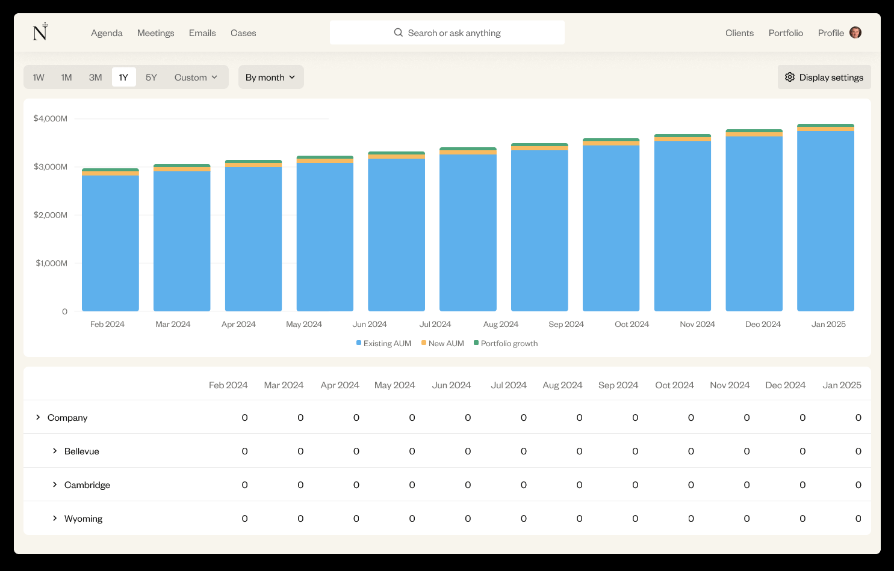

# Nevis wealth challenge

Implement dashboard to render [financial data](/task/data.json) based on the provided design.

The dashboard consists of:

1. Stacked bar chart showing data over time.
2. Table displaying detailed data per year, with expandable rows to show subcategories.

## Requirements

- Use React for rendering UI.
- Use TypeScript for type safety.
- Use Node.js to serve data via REST API.
- Ensure components are modular and reusable.
- Include tests for UI.
- The UI and functionality must closely match the provided design.
- Free to use any CSS frameworks, charting libraries and state management libraries.
- Expected time to complete **within 4 hours**.

## How to deliver

Clone this repository into your GitHub account. Once completed, invite [@maxgrb](https://github.com/maxgrb) to the repository.

Make sure your repository have instruction on how to run and test the code.
